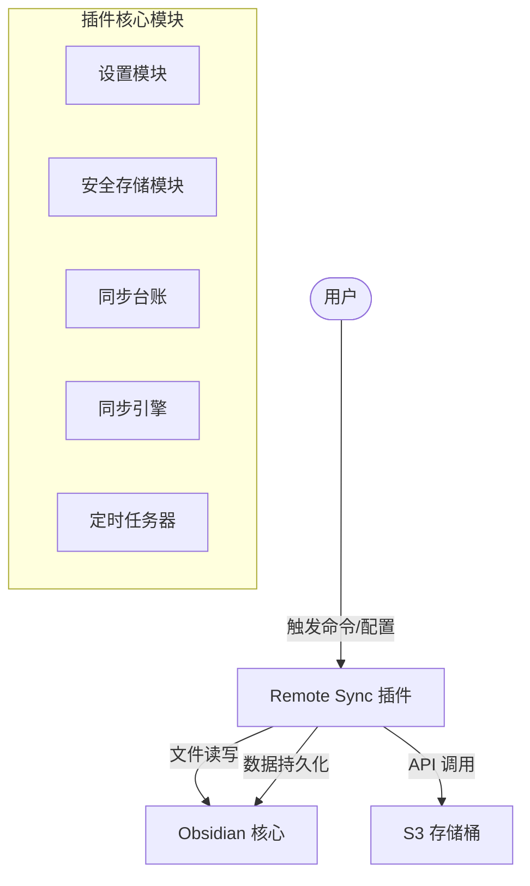
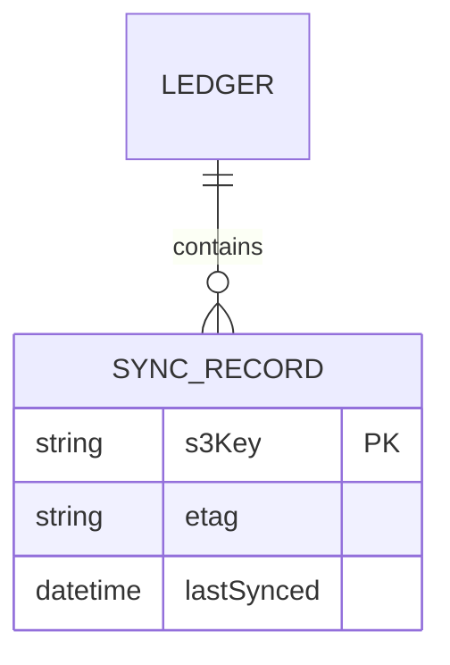
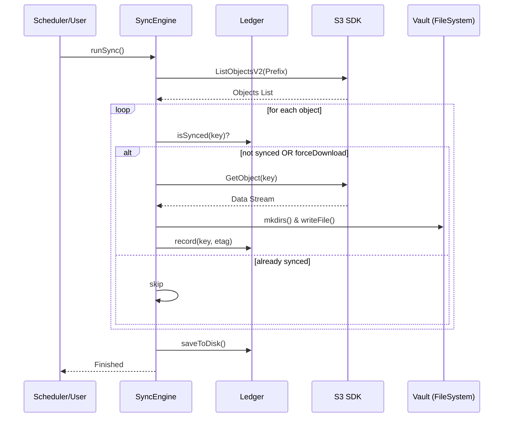

# Remote Sync 技术架构设计 (Technical Architecture Design)

本文档定义了 Obsidian S3 远程同步插件的技术实现方案。

## 1. 技术选型 (Tech Stack)

| 维度 | 选型 | 理由 |
| :--- | :--- | :--- |
| **最低版本** | Obsidian v1.11.0+ (推荐) | 原生支持 `SecretStorage`。旧版本将自动降级至自定义混淆存储。 |
| **编程语言** | TypeScript | Obsidian 插件标准，提供强类型支持。 |
| **S3 SDK** | `@aws-sdk/client-s3` | AWS 官方 SDK，支持现代 ES 模块，功能完整。 |
| **插件 API** | `obsidian` | 官方提供的文件、设置及通知接口。 |
| **持久化** | `this.saveData()` | 兼容 Obsidian 同步服务，数据存储在插件目录下。 |

## 2. 系统概览 (System Overview)

### 架构图 (Architecture Diagram)


### 核心模块说明
- **SecretManager (安全存储)**: 封装 `this.app.loadSecret` 和 `saveSecret`（通过 `secretStorage` 探测多种变体）。优先利用 OS 级安全存储保证密钥不被同步；若 API 不可用或配置受限，自动降级为 **XOR (0x53) + Base64** 混淆存储在本地 `data.json` 中。
- **SyncLedger (台账)**: 记录已同步文件的 Key 和 ETag，确保“一次性抓取”。
- **SyncEngine (同步引擎)**: 处理 S3 列举、目录创建及文件流式下载。
- **Scheduler (调度器)**: 使用 `setInterval` 管理后台静默同步。

## 3. 数据库与数据结构 (Data Design)

### 配置结构 (Settings)
```typescript
interface RemoteSyncSettings {
    endpoint: string;
    region: string;
    bucket: string;
    // accessKeyId 和 secretAccessKey 通过 SecretStorage API 独立存储
    s3Prefix: string;
    localBasePath: string;
    syncInterval: number;
    forceReDownload: boolean;
}
```

### 台账结构 (Ledger ER Diagram)


## 4. 关键流程设计 (Key Workflows)

### 同步时序图


## 5. 前端组件设计 (Front-end Components)
- **SettingsTab**: 继承自 `PluginSettingTab`。
- **ConnectionStatus**: 设置页面中的状态指示器，显示验证结果。

## 6. 非功能性需求 (Non-Functional Requirements)

### 安全性 (Security)
- **NFR-1**: 密钥必须优先使用 Obsidian 原生 `SecretStorage` API 存储。
- **NFR-2**: 若原生 API 失败，必须通过自定义混淆算法 (XOR 0x53) 进行降级保护，严禁明文保存。
- **NFR-3**: 设置界面必须对已保存的密钥进行掩码显示，并提供“眼睛”图标切换明文。

### 可靠性 (Reliability)
- **NFR-3**: 目录创建遵循“先检测后创建”策略，避免破坏本地现有非 S3 同步的文件夹。

> [!TIP]
> 上述 NFR 已转化为 User Stories US-4.1 (安全性) 和 US-2.1 (可靠性)。
